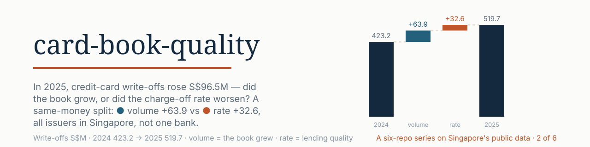
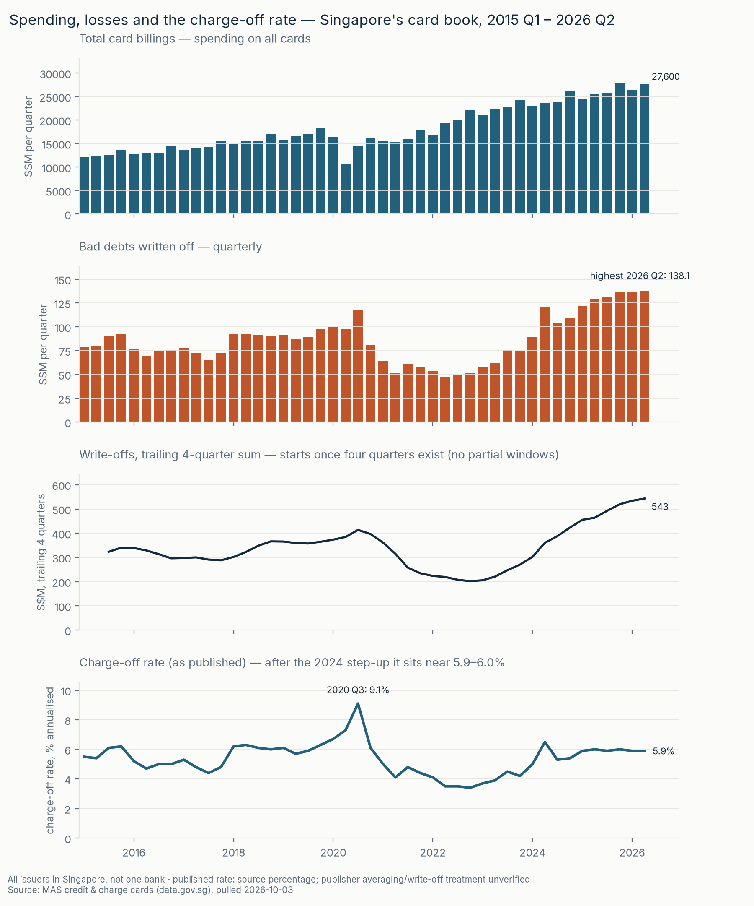
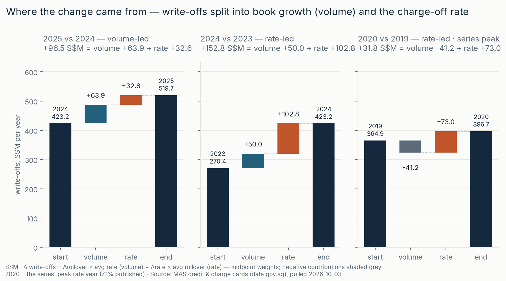
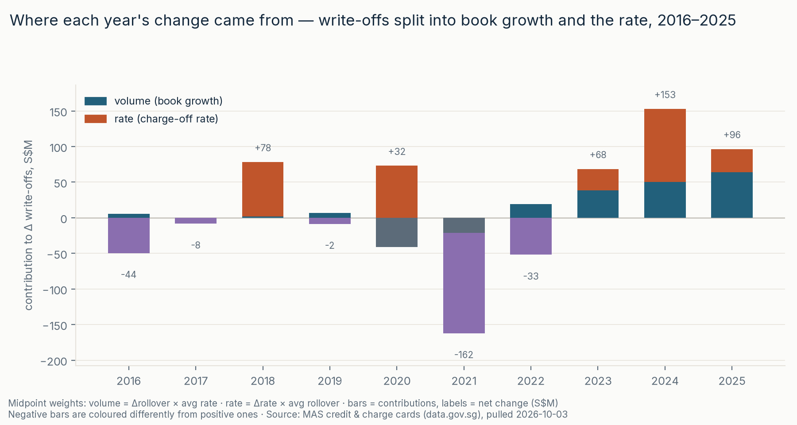
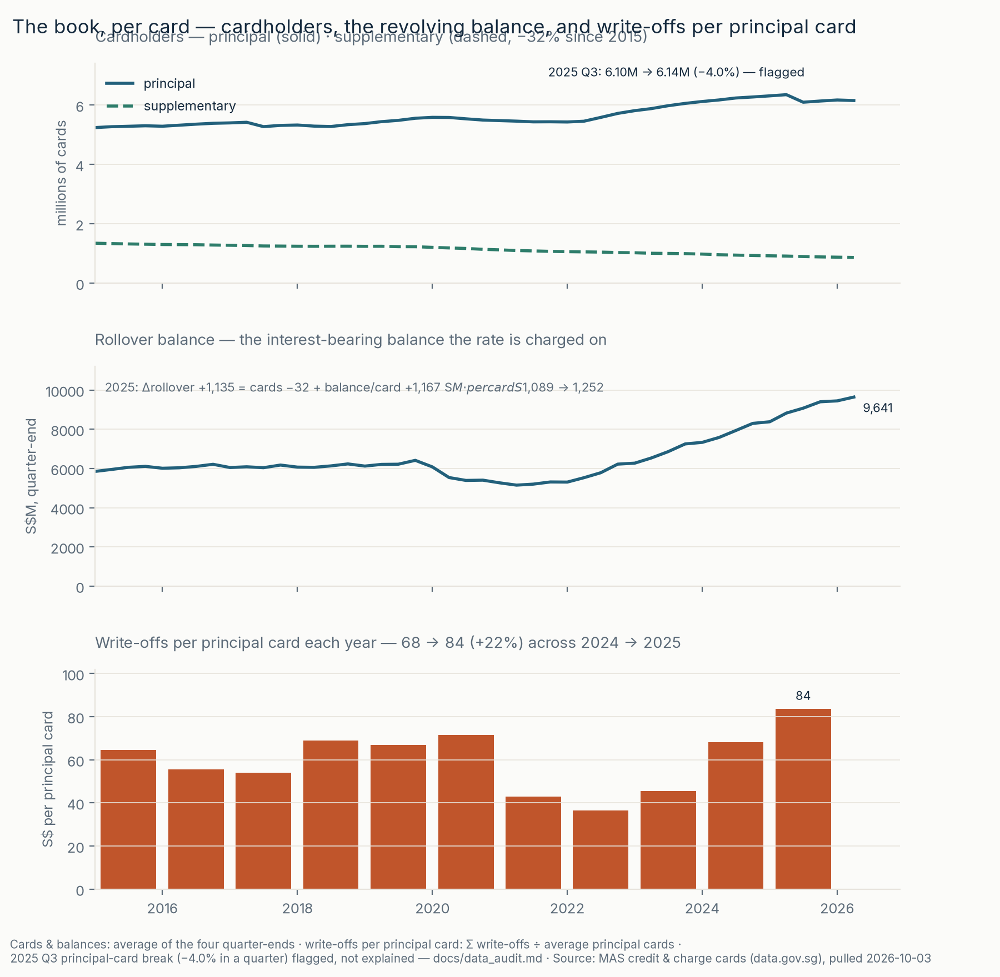

<picture>
  <source media="(prefers-color-scheme: dark)" srcset="assets/banner-dark.svg">
  
</picture>

# card-book-quality

**Muhammad Faiz Saifulnizam** · Singapore data-analytics portfolio

## [Read the analysis → live report](https://faizsaifulnizam.github.io/card-book-quality/)

[](https://github.com/faizsaifulnizam/card-book-quality/actions/workflows/ci.yml) [](LICENSE) [](https://data.gov.sg/datasets/d_5c8e5801c2a64e2e6b16608296ef3e02/view)

**Question:** Did Singapore's card write-offs rise because outstanding revolving balances grew, or because the loss ratio increased?

> **2025 write-offs rose S$96.5 million.** An arithmetic split assigns **S$63.9 million to higher balances** and **S$32.6 million to a higher recomputed loss ratio**. The larger ratio increase happened in 2024; the published quarterly rate then stayed at 5.9–6.0% from 2025 Q1 through 2026 Q2.
>
> **More balance does not establish more customers or better business.** Average reported total card count fell 0.4%, while aggregate rollover balance per reported card rose 15%. Unique customers are not measured. Balances can rise with spending or slower repayment; this file cannot separate those explanations.

**Fixed historical analysis:** raw-data snapshot pulled **2026-10-03**, quarterly coverage **2014 Q4–2026 Q2**, headline **2025 vs 2024**. Written findings are maintained manually, not an automatically refreshing report. A new pull requires a new review of text, tests, charts and workbook before publication.

<picture>
  <source media="(prefers-color-scheme: dark)" srcset="reports/figures/f1_timeline-dark.png">
  
</picture>

[View full-size timeline](reports/figures/f1_timeline.png) · [dark version](reports/figures/f1_timeline-dark.png)

## Decision implications

For a credit-risk analyst, this split sets the investigation order, not a bank policy. Test whether higher balances reflect exposure growth among healthy borrowers, worsening borrower cohorts, or reporting/count changes. That needs issuer-level utilisation, revolving-account counts, repayment and delinquency evidence, plus definition reconciliation around the count break. These are hypotheses, not findings from the aggregate file.

Escalate to an issuer-level credit-risk review when corroborated repayment and delinquency evidence supports deterioration, not because balances or write-offs rose alone. Blanket tightening can restrict healthy borrowers' access, but ignoring deterioration can leave losses unchecked. No lending-policy prescription is justified until issuer data separates those explanations. The [decision memo](docs/decision_memo.md) maps each hypothesis to evidence and a conditional response.

## What I did

This is a **Hermes-assisted portfolio project**: Hermes implemented the pipeline and presentation; Faiz approved the question, comparison years, decomposition method and wording at the review gate, in line with the shared portfolio plan. It is not presented as unaided coding. The work demonstrates SQL staging and checks, flow-versus-stock metric definitions, reproducible arithmetic decomposition, source reconciliation and communication of limits. External LLM reviews were treated as hypotheses to verify, not authority: see the [review disposition](docs/review-remediation.md).

## Key numbers

All money below is **S$ million** unless labelled per card. Dollar write-offs use quarterly sums, so 2025 is **519.7**, compared with **519.8** in the separately rounded annual source.

- **Headline:** 2024 → 2025 write-offs **423.2 → 519.7**; **+96.5 = balance +63.9 + ratio +32.6** ([yearly bridge](outputs/yearly_bridge.csv)).
- **The path:** 2024 vs 2023 **+152.8 = +50.0 + +102.8**, with a **+1.42 percentage-point** proxy-ratio step. Comparing the 2022 and 2025 endpoints, **+317.8 = +150.4 + +167.4**; the ratio term is larger. This is an endpoint split, not the sum of yearly contributions. The smaller **+0.39 pt** proxy-ratio increase in 2025 is a different comparison, and its annual average lags the quarterly path.
- **Balance denominator matters:** 2025 annual-average rollover rose **+1,134.825**. With total reported cards the balance split is approximately **cards −32 / per-card +1,167**; with principal cards alone it is **cards +30 / per-card +1,105**. Supplementary counts affect the sign; neither measure is unique borrowers. [Sensitivity](docs/sensitivity.md) also compares annual-average and year-end bases.
- **Other windows:** trailing four quarters **+79.3 = +58.4 + +20.9**; H1 2026 vs H1 2025 **+23.7 = +27.2 − 3.5**. These are same-season comparisons, not proof that seasonality is removed.
- **Published-rate sensitivity:** balance contribution changes **−0.3507**, ratio contribution **+0.8124**, with a separate **−0.46175 basis-and-rounding residual**. The old “within ±0.5” claim was wrong ([calculation](docs/sensitivity.md)).
- **Unexplained break:** principal count **6,349,360 → 6,095,333** from 2025 Q2 to Q3 (**−4.0%**); annual-average card ratios inherit it. No adjustment is invented.

### Detailed charts and workbook

<a href="reports/figures/f2_bridge.png"><picture><source media="(prefers-color-scheme: dark)" srcset="reports/figures/f2_bridge-dark.png"></picture></a>

[View full-size bridge](reports/figures/f2_bridge.png) · [dark version](reports/figures/f2_bridge-dark.png)

<a href="reports/figures/f3_contributions.png"><picture><source media="(prefers-color-scheme: dark)" srcset="reports/figures/f3_contributions-dark.png"></picture></a>

[View full-size annual contributions](reports/figures/f3_contributions.png) · [dark version](reports/figures/f3_contributions-dark.png)

<a href="reports/figures/f4_book.png"><picture><source media="(prefers-color-scheme: dark)" srcset="reports/figures/f4_book-dark.png"></picture></a>

[View full-size card-count analysis](reports/figures/f4_book.png) · [dark version](reports/figures/f4_book-dark.png)

**[Excel quick-check](outputs/quick_check.xlsx)** — quarter selector, trailing-four-quarter sum and annual bridge formulas. Requires an Excel version supporting **XLOOKUP** (Microsoft 365 / Excel 2021 or later). Formula-only, no macros; readers that do not recalculate may show blanks. Formula structure and Python input checks are not proof of spreadsheet-engine evaluation. [Releases](https://github.com/faizsaifulnizam/card-book-quality/releases) are frozen downloads and may differ from the working tree.

## The data

- **Primary:** [Credit and charge cards, quarterly](https://data.gov.sg/datasets/d_5c8e5801c2a64e2e6b16608296ef3e02/view), MAS via data.gov.sg: 47 quarters, six series. [Annual source](https://data.gov.sg/datasets/d_b40deadbdc470e97b9e16de99c5e6ee2/view) is a cross-check, not the bridge's balance denominator.
- **Units:** card counts are reported principal/supplementary series, not deduplicated people; billings and write-offs are period flows in S$M; rollover is a quarter-end stock in S$M; published charge-off rates are annualised percentages, not interest rates or default probabilities.
- Both small CSVs are vendored under `data/raw/` with a byte-SHA-256 manifest. Metadata JSONs are **historical reference captures**, not guaranteed to refresh with CSVs. See [source trail and retrieval limits](docs/data_audit.md) and [raw-data notes](data/raw/README.md).
- Data: Singapore Open Data Licence, © Monetary Authority of Singapore / SingStat. Code: MIT. Independent, unofficial analysis.

## Method

One tidy row per quarter, DuckDB for staging and metrics, Python for decomposition and presentation:

1. **Acquire** — [`src/download.py`](src/download.py) reads the vendored snapshot or explicitly re-pulls with `--force`; provenance is in `pull_manifest.json`.
2. **Audit** — [`src/audit.py`](src/audit.py) independently prints raw-file evidence; the manually maintained [audit](docs/data_audit.md) is based on it, not generated by it.
3. **Stage and check** — [`sql/01_staging.sql`](sql/01_staging.sql) unpivots six wide series; [`sql/03_checks.sql`](sql/03_checks.sql) checks completeness, calendar continuity and ranges before dataset publication.
4. **Measure** — [`sql/02_metrics.sql`](sql/02_metrics.sql): complete calendar years; sum flows, average four quarter-end balances for the bridge. Trailing-four-quarter sums require four contiguous quarters (`ROWS 3 PRECEDING` plus a full-window guard).
5. **Split and stress-test** — [`src/analysis.py`](src/analysis.py) produces [annual bridge](outputs/yearly_bridge.csv), [card/balance split](outputs/book_split.csv) and [sensitivity](outputs/sensitivity.csv).
6. **Communicate** — [`src/figures.py`](src/figures.py) generates light/dark charts and site copies; [`src/build_workbook.py`](src/build_workbook.py) constructs formulas. This README, site and [decision memo](docs/decision_memo.md) are maintained prose.

### The comparison and bridge, in words

The headline compares complete calendar **2025 vs 2024**. Using full years avoids comparing different quarter positions; it does not establish a seasonality-free result. Pooled quarter-of-year averages differ by about 0.25 pt in this sample, but mix changing annual levels with any seasonal pattern.

Define **recomputed proxy ratio = annual sum of write-offs ÷ average of four quarter-end rollover balances**. This is our denominator choice, not a reconstruction of unobserved monthly averaging. It makes `write-offs = ratio × balance` hold exactly at full precision. Its agreement with published annual rates (within 0.05 pt over 2015–2025) is empirical, not proof of identical definitions or a future tolerance guarantee.

```text
Δ write-offs = Δrollover × average ratio     balance/“volume” contribution
             + Δratio × average rollover   recomputed-ratio contribution
```

**Midpoint weights** mean the average of the old and new values. They allocate the product's interaction symmetrically, closing the change by algebra; the reported interaction is zero **by construction**, not a discovery. Base-year weights instead expose **+4.43 S$M** as a joint term. A published-rate substitution leaves a **basis-and-rounding residual**, not an interaction.

Rollover is used because it is the revolving balance against which losses are measured. Billings are spending flow, not the loss-ratio denominator. “Volume” means balance size, **not customers, business health or confirmed stress**. A ratio change is not automatically a lending-quality change: mix, write-off timing, accounting, recoveries and denominator movement may matter.

### Rules chosen, and why

| Rule | Choice and reason |
|---|---|
| Years | Latest complete calendar years in this fixed snapshot; incomplete 2026 enters only through explicit alternative windows |
| Ratio | Recomputed quarter-end-balance proxy for exact bridge closure; published annual ratio shown separately |
| Split | Midpoints for a symmetric two-term split; base-weighted joint term disclosed |
| Cards | Total and principal denominators separately; annual-average versus year-end sensitivity, with the count break unresolved |
| Outliers | No aggregate trimming; nothing excluded from this snapshot |
| Rollover/billings | Average quarter-end rollover ÷ average quarterly billings for the year: **0.321 → 0.344**. Stock-to-flow ratio, not unpaid-spending share or fraction of customers revolving |

### Validation — what each check can prove

- **Raw arithmetic:** `python src/audit.py` profiles 47 contiguous quarters and six populated series, prints annual flow/stock cross-checks and proxy ratios. In this snapshot, flows reconcile within 0.1 S$M; annual rollover and principal-card stocks match Q4; annual proxy ratios differ from published rates by at most 0.049 pt.
- **Calculation:** bridge closure follows algebra. Independent raw-CSV calculations in `tests/test_narrative.py` check the headline, published-basis differences and card-denominator sensitivities against maintained text.
- **Presentation:** narrative tests check required caveats and full-size chart links. They do not visually inspect charts or evaluate Excel formulas.
- **Workbook:** formula/input regressions are separate from recalculation. The installed LibreOffice engine was run headlessly in an isolated profile and calculated the default **543.4 S$M** trailing sum and **−0.1 pt** rate change, a recent-quarter change, early-history blank, invalid-selection message and all ten annual comparisons. Microsoft Excel itself and non-recalculating preview caches were not verified. Default quarterly write-offs are **138.1 S$M** for 2026 Q2.
- **Reproducibility:** `requirements.lock` fully resolves dependencies with hashes and matches the tested Python 3.12 environment. `python tests/verify_reproducibility.py` repeats the pipeline and SHA-256-compares all 20 generated CSV/workbook/chart artifacts, also checking site chart copies. This proves repeated bytes in one environment, not PNG equality across operating systems. CI runs this check, the regressions and the committed-CSV diff; the badge is not a blanket certification. `lxml` was unavailable locally: namespace-serialization variants and the default XML backend were tested, not an actual lxml run.
- **Rounding:** displayed bridge contributions are rounded to two decimals; display-rounding gaps are distinct from the published-basis residual.

## Reproduce

```bash
git clone https://github.com/faizsaifulnizam/card-book-quality && cd card-book-quality
uv venv .venv --python 3.12 --seed   # seed pip; or: python -m venv .venv
source .venv/bin/activate            # Linux/macOS Bash
# Windows Git Bash: source .venv/Scripts/activate
# Windows PowerShell: .\.venv\Scripts\Activate.ps1
# Windows cmd.exe: .venv\Scripts\activate.bat
python -m pip install --require-hashes -r requirements.lock

python src/run_all.py        # uses vendored raw data; no data-fetch network required
# or individually:
python src/download.py
python src/build_dataset.py
python src/analysis.py
python src/figures.py
python src/build_workbook.py
# independent evidence and narrative regressions:
python src/audit.py
python -m unittest discover -s tests -p test_narrative.py
```

Check the 2025 CSV row: **+96.5 = +63.9 + +32.6**. `run_all.py` builds and validates a disposable copy before publishing the complete generated set; stage failures preserve existing outputs, and ordinary publication exceptions trigger rollback. Directory swaps are **not crash/power-loss atomic** and require a single writer. Running stages individually does not provide whole-run rollback. Refresh acquisition waits until the annual source covers every complete quarterly year; standalone analysis can expose pending annual cross-checks, but that does not authorize publishing a refreshed snapshot without review of all fixed-snapshot claims.

## Caveats and out of scope

- All issuers in Singapore, not one bank: no issuer, product, borrower, vintage or repayment segmentation.
- Unique customers and revolving-account counts are unavailable. Aggregate rollover per reported card includes non-revolving cards; it is not average debt among borrowers who revolve.
- Principal-only counts do not remove the unexplained Q3 2025 break. Year-end counts fall even though principal annual averages rise slightly; denominator choice changes the card component, not the dominance of the per-card proxy component.
- Balance growth can reflect slower repayment as well as expansion. The aggregate file cannot establish accumulating stress; delinquency, repayment, utilisation and issuer-level evidence are needed.
- Charge-off ratios are loss measures, not interest rates, default probabilities or an isolated measure of credit quality. Write-off timing and source revisions can change the history.
- No forecast, causal attribution, lending-policy prescription, issuer-level early-warning model or cross-country comparison.

## Licence

Code: MIT. Data: Singapore Open Data Licence — © Monetary Authority of Singapore / SingStat, via data.gov.sg. This is an independent, unofficial analysis.

---

*Six-on-SG: six Singapore-data analyses plus one AI workflow — seven repos: [hdb-resale-mart](https://github.com/faizsaifulnizam/hdb-resale-mart) · [coe-quota-premium](https://github.com/faizsaifulnizam/coe-quota-premium) · [retail-sales-split](https://github.com/faizsaifulnizam/retail-sales-split) · [ai-analyst-workflow](https://github.com/faizsaifulnizam/ai-analyst-workflow) (the AI-workflow add).*
